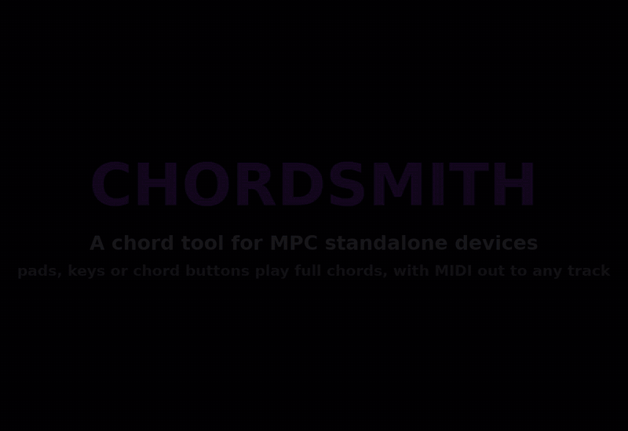

# Chordsmith (MPC VST Plugin)

A chord tool for Akai MPC OS standalone devices (MPC Live/One/X/Key, Force), built as a native VST2
instrument for MPC's own plugin host, with its own screen skin and Q-Links. Pick a key and scale (or a
chord set, or eight chords of your own), and pads or keys play full chords; or build chords from a root and
held type and extension buttons, and play them strummed, arpeggiated or in a rhythm in time with the project.
It all runs on the device.

**Status:** passes the offline tests (x86, ASan/UBSan), builds for armhf, and every function has been run
on an MPC Key 37 (firmware 3.9.1.2) from the screen, pads and keys.



The same tour as a video, recorded from the device screen while the pads, keys and touchscreen were driven
from a script: [docs/chordsmith.mp4](docs/chordsmith.mp4) (two minutes, with captions).

## What it does

- **PLAY**: **PLAY FROM** picks what plays the chords (PADS, KEYS or the chord BUTTONS), and the
  **PREVIEW SYNTH** switch and the output line at the bottom say where they go ("PREVIEW SYNTH + MIDI OUT
  CH 2"). KEY + SCALE (major, minor, harmonic/melodic minor, the modes) gives eight chords: the seven
  diatonic chords and the tonic an octave up, as triads, 7ths, 9ths, sus2 or sus4. CHORDS FROM = SET swaps
  them for one of 20 progression sets (Pop Axis, Neo Soul, Jazz ii-V-I, Lo-Fi, Trap Minor, Andalusian, …),
  transposed to the key. CHORDS FROM = **CUSTOM** is a chord builder: eight chords of your own, one per pad
  (and per white key with PLAY FROM = KEYS), saved with the project. Tap a tile (or step EDIT) to pick the
  pad, then step ROOT and CHORD (43 qualities, from a major triad to m11 and 13); **COPY** takes the chords
  SCALE or SET last showed, as a starting point to change a chord or two. The tiles sit like the pad bank
  (pads 1-4 along the bottom, 5-8 above), numbered, or lettered C-B on the keys; a chord's tile lights while
  it sounds, whether a pad, a key or a tap played it. Under them, the PLAYED line lists the last chords in
  order and the bottom line names what just played, note by note.
- **VOICE**: close, drop 2, drop 3 or spread voicings, inversions, octave, a bass note, and **voice
  leading** (each chord takes the inversion nearest the last one). Strum (0-100 ms between notes, up or
  down) and played or fixed velocity.
- **BUTTONS**: with PLAY FROM = BUTTONS, build each chord from a root and buttons, the way a chord keyboard
  works: hold a chord type (DIM, MIN, MAJ, SUS4) and any extensions (6, m7, maj7, 9) and play a root. With no
  type held the screen's CHORD TYPE applies; AUTO is the chord KEY/SCALE gives that root, so plain roots
  play in key. The screen's ADD switches add to whatever is held, and changing buttons while a chord sounds
  re-chords it. Combinations add up: MAJ + 9 is maj9, MIN + 6 + 9 is m6/9, a 9 alone brings the key's 7th
  with it. With **PAD BUTTONS** on, pads 1-4 are the extensions, pads 5-8 the chord types and pads 9-16 the
  roots I-vii and I an octave up; keys play the chord on their own note. **LATCH** keeps a chord sounding
  after you let go, until the next one.
- **PERFORM**: how a chord is played, in time with the project tempo: all at once (CHORD), loosely
  (SLOP), arpeggiated up, down or up/down, run across four octaves (HARP), or as one of three rhythms
  (PATTERN 1-3), at 1/4 to 1/32 notes. The **VOICING** dial walks the chord through its inversions: each
  step up moves the lowest note up an octave, each step down the top note down, and a bass note stays put.
  BASS CHANNEL sends the bass note on its own MIDI channel, for a separate bass sound.
- **SETUP**: PAD 1 NOTE (pads 1-8 play the chords from it, pads 9-16 the same chords an octave up), the
  MIDI channel (2 by default; see below), ALL NOTES OFF, the port status, and the **preview synth** level:
  with PREVIEW SYNTH on (the default) Chordsmith plays its chords itself on a simple electric-piano-ish
  synth, so you can try it without routing anything. Turn it off once the MIDI port drives a real
  instrument. PLAY FROM = KEYS plays chords from the MPC's keybed (MPC Key 37/61) or any MIDI keyboard on
  the track; MPCs without keys just leave it on PADS. Two key maps:
  - **WHITE KEYS**: C-B play chords 1-7 of whatever is loaded (scale or set), in any octave.
    Each black key plays the chord to its left with more colour: a triad gets its 7th, a 7th chord its
    9th (picked from the scale where they fit), a 9th goes back to the triad.
  - **SCALE NOTES**: every key plays the chord built on that note in KEY/SCALE, where you play it. Keys off
    the scale play borrowed chords: the parallel major/minor's chord (Eb, Ab, Bb in C major), the
    Neapolitan bII, otherwise a dim7.
  - **SPLIT**: keys below SPLIT POINT play chords, keys from it up pass straight through as single notes,
    so you can play a melody over the chords.

## How the chords reach a sound

MPC OS ignores a plugin's VST MIDI output, so Chordsmith sends its notes through its own ALSA sequencer port,
**Chordsmith MIDI Out**, as other MIDI-generating plugins for MPC OS do. To set it up:

1. Put Chordsmith on a track. Play that track's pads or keys.
2. Preferences → MIDI: enable **Track** on "Chordsmith MIDI Out" (MPC finds the port by itself, without a restart).
3. On the track with the instrument you want to hear, set its MIDI input to that port and turn monitoring on.

Turn PREVIEW SYNTH off (PLAY or SETUP tab), or you'll hear the preview synth on Chordsmith's track as well.

MPC enables new MIDI ports for track input by default, so Chordsmith's own notes can come back into its
track. It ignores them, but MPC merges an echoed note with a key you're holding on the same note and
channel, and then that key's release never arrives and its chord hangs. That's why Chordsmith sends on
channel 2 by default (your keys play on channel 1). If you set the MIDI channel to the one your keys use, the
output line on PLAY says `MIDI CH 1 IS THE KEYS' CHANNEL: CHANGE IT` when that happens.

PAD 1 NOTE has to match the notes your pads send. MPC's pad modes (a scale layout, for example) send other
notes, so set the track's pads to plain chromatic notes from PAD 1 NOTE (36 = C1 by default) for PADS and
the pad buttons.

## Building

Needs Docker (with QEMU for arm32v7) and a checkout of
[mpc-vst-plugins](https://github.com/sd88me/mpc-vst-plugins) next to this repo (or `MPC_VST=/path`).

```sh
vst/test.sh    # offline: theory and engine tests, then mpc-vst-plugins' host test (x86, ASan/UBSan)
vst/build.sh   # vst/build/chordsmith.so, the skin (with the INSTRUMENTS browser tile and a Default preset) and pluginlist-entry.xml (armhf, glibc <= 2.36)
```

### Releasing

`.github/workflows/release.yml` builds a draft release with mpc-vst-plugins' reusable workflow
(`workflow_dispatch`, pass a version). To release by hand instead, as mpc-vst-plugins' `docs/RELEASING.md`
describes:

```sh
B=vst/build; python3 $MPC_VST/tools/release.py --so $B/chordsmith.so --skin "$B/skin/jacob-sabella - VST - Chordsmith" \
  --entry $B/pluginlist-entry.xml --version 1.0.0 --repo jacob-sabella/mpc-vst-chordsmith --license MIT \
  --bench vst/bench.txt -o dist
python3 $MPC_VST/tools/catalog_check.py dist/Chordsmith-1.0.0-mpc-armv7.zip --catalog
```

`tested.json` lists the devices and firmwares a version has been tested on (the catalog shows it as "Tested on").

The engine is plain C on mpc-vst-plugins' generic wrapper (`wrapper/engine.h`, `vst2_wrap.c`):

- `src/theory.c`: scales, chord qualities, chord sets, names and voicings.
- `src/chordsmith.c`: the engine (input mapping, button chords, strum/arp/pattern scheduling, latch, held
  notes, the echo filter, state). It takes the host tempo through the wrapper's `lfo_bpm` (`HAS_LFO_BPM`).
- `src/synth.c`: the preview synth (16 voices, sine table, no allocation on the audio thread).
- `src/seq_out.c`: the ALSA port. It loads `libasound.so.2` at runtime, so building needs no ALSA headers.
  The hand-written event struct is checked against the real header in the tests.

Parameters are append-only (projects and Q-Links store them by index): add new ones at the end of
`vst/params.json`.

## License

MIT, see [LICENSE](LICENSE).
